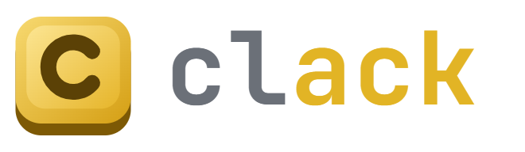
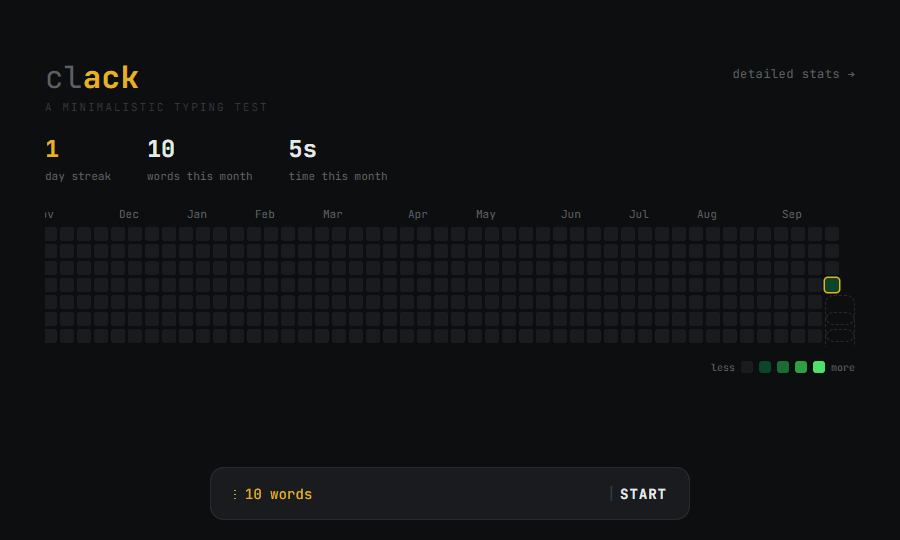

<p align="center"></p>

A minimalist typing test — inspired by the Bemonkey iOS app and built as a single self-contained `index.html` with no build step and no dependencies.

**Live demo:** https://bralash.github.io/clack/



## Features

### Modes
- **Time** — 15 / 30 / 60 / 120 / 180 second runs.
- **Words** — 10 / 25 / 50 / 100 word runs.
- **Quote** — type real quotes (short / medium / long); the result screen credits the author.
- **Shoot** — a ZType-style typing game: words drift toward your ship, type one to lock on and fire, destroy it before it reaches the base. Difficulties: `calm` / `normal` / `frenzy`.
  - **Power-ups** fall as glowing capsules — type the name to grab it:
    `freeze` slows everything down for 5s · `double` doubles points for 10s ·
    `shield` restores a life or blocks the next hit · `boom` stores a bomb you set off with **Space** to clear the screen.
    Missing a power-up never costs a life.

- **Daily challenge** — the same 30 words for everyone each day, one attempt. Share your result as a Wordle-style
  grid (🟩 clean word, 🟨 mistake), post it to 𝕏, or save a result-card image. Consecutive days build a daily streak.

Time and words runs support **punctuation**, **numbers** and **weak keys** modifiers. Weak keys fills a run with words
built from the keys you miss most — also one click away on the stats page. Words **auto-advance** the instant you finish them (right *or* wrong), so nothing interrupts your flow.

### Feel
- Soft mechanical **key-click** and a dull **error thud** (Web Audio, toggleable, with haptics).
- A **caret that pulses** with your rhythm, a **shake** on errors, and a **glow** when you nail a word.
- A faint **live-WPM** readout that rises as you type.
- A **combo multiplier** that grows with each clean word and resets on a mistake.

### Progress & stats
- The home screen shows your **day streak** and **this week** (Monday to Sunday, a square per day) at a glance, plus
  this month's totals on wider screens.
- A **stats page**: a GitHub-style **activity heatmap** (six months on screen, a year to scroll through), per-key accuracy
  (which keys you fumble), a WPM-over-time chart, and personal bests per mode.
- Results compare each run with **your average** for that mode and device, and flag runs that count for the
  leaderboard with a 🏆 **ranked** tag before you start.
- **Keyboard first:** <kbd>Enter</kbd> starts a run and plays again from the results, <kbd>Tab</kbd> restarts, <kbd>Esc</kbd> quits.
- **Achievements** — 16 badges (speed tiers, accuracy, streaks, volume, combo, variety and four shooter badges), each with its own emblem and an unlock celebration.
- **Help page** — "how it works" explains every mode, the WPM maths, the shooter, power-ups and achievements.

### Clack School
New to typing? Clack School teaches touch typing from zero across four units — **get set** (hand position),
**home row**, **top row** and **bottom row** — 19 short lessons in all. Each lesson introduces one or two keys:
**meet** them (glowing fingertip pads on an on-screen keyboard show which finger reaches where), **drill** the motion, type **words**
made only from keys you know, then a scored **check**. Wrong keys don't advance and name the finger you used by mistake.
Lessons unlock at 90% accuracy and earn up to three stars; the on-screen keyboard fades while you type accurately so you
learn not to look. The **get set** lesson opens with a picture of both hands in the home position, and a **hand position**
button brings it back during any lesson (the clock pauses while it's open). First-time visitors are asked whether they can already touch type.

Clack School is a **keyboard feature**: it teaches 10-finger typing, which doesn't apply to a phone's on-screen keyboard.
On phones the course map explains this and offers to share the link so you can open it on a computer. Lessons unlock as soon
as a physical keyboard is detected (an iPad keyboard case, or a Bluetooth keyboard on a phone).

### Leaderboard & sync
- Three boards — **daily**, **30s** and **60s** — each with separate **keyboard** and **phone** lists, and
  today / this week / all time views for the timed boards.
- **No accounts.** Pick a name and Clack gives you a **recovery code** (`clack-XXXXX-XXXXX-XXXXX-XXXXX`) — the key to that
  name. Enter it on another device to sign in there; stats, clacks, badges and store items **sync** between devices.
  Names can change once every 60 days; names unused for six months are released.
- **Verified scores:** runs are sent as keystroke logs and the server replays them to compute wpm and accuracy itself,
  rejecting runs that don't match the words, overrun the clock, exceed 250 wpm or have machine-regular timing.
- Fully optional: nothing leaves the device until you pick a name, and you can delete your name and scores any time.
- The stats page can split **keyboard vs phone** runs, so you can compare your speed on each.

### Clacks & the store
- **Clacks** are earned by playing: ~1 per 25 correct characters in a typing run (15s / 10 words minimum),
  1 per 20 shooter points, +20 for the daily (plus a daily-streak bonus), +15 for a new personal best, and a one-off
  reward for every badge.
- The **store** sells 3D-rendered shooter **ships** (Dart, Stealth Wing, Saucer, Pixel, Comet, Obsidian; the art is cut
  from `brand/ships.png` into `brand/ships/` by `server/scripts/cut-ships.mjs`) and bullet **trails**
  (Dotted, Laser, Plasma, Ember, Rainbow), each with a live animated preview. Some also need a badge.
  Everything is cosmetic — nothing changes your score.

### Polish
- **Light and dark** themes.
- Fully **responsive** — works from desktop down to phones, including on-screen-keyboard support on touch devices.

## Run it

It's a static page — just open the file:

```bash
open index.html   # or double-click it
```

Or serve it locally:

```bash
python -m http.server 8000
```

then visit `http://localhost:8000`.

## Deploy (GitHub Pages)

Because it's a single static file, you can host it for free:

1. Push to GitHub (already done).
2. Go to **Settings → Pages**.
3. Under **Build and deployment**, set **Source: Deploy from a branch**, **Branch: `main`**, **Folder: `/ (root)`**, and Save.
4. After a minute it's live at `https://<user>.github.io/clack/`.

## Storage

All progress is stored locally in your browser via `localStorage`. Nothing is sent anywhere unless you join the leaderboard:

- `clack_activity` — daily activity that drives the heatmap
- `clack_stats` — per-key accuracy, WPM history (tagged keyboard or phone), personal bests, achievements, modes tried, daily results, clacks and store items
- `clack_theme` — light / dark preference
- `clack_mods` — punctuation / numbers toggles
- `clack_sound` — sound & haptics on/off
- `clack_online` — your name, recovery code, sync state and any runs waiting to be posted (only after you join)

Without a name, progress is per browser, per device. With one, it syncs through the API to every device you sign in on.
Clearing your browser's site data resets this device; keep your recovery code to get your name back.

## Leaderboard API

The leaderboard, names and sync run on a small [Cloudflare Worker](server/) with a D1 (SQLite) database —
free at Clack's scale. See [server/README.md](server/README.md) for running it locally and deploying.
`API_PROD` in `index.html` points at the deployed Worker; set it to `""` to switch the leaderboard off.

## Tech

Vanilla HTML/CSS/JS in one file. Monospace type (JetBrains Mono via Google Fonts), Web Audio for sound, `<canvas>` for the shooter and the WPM chart, `localStorage` for persistence, CSS custom properties for theming.

## License

MIT — see [LICENSE](LICENSE).
